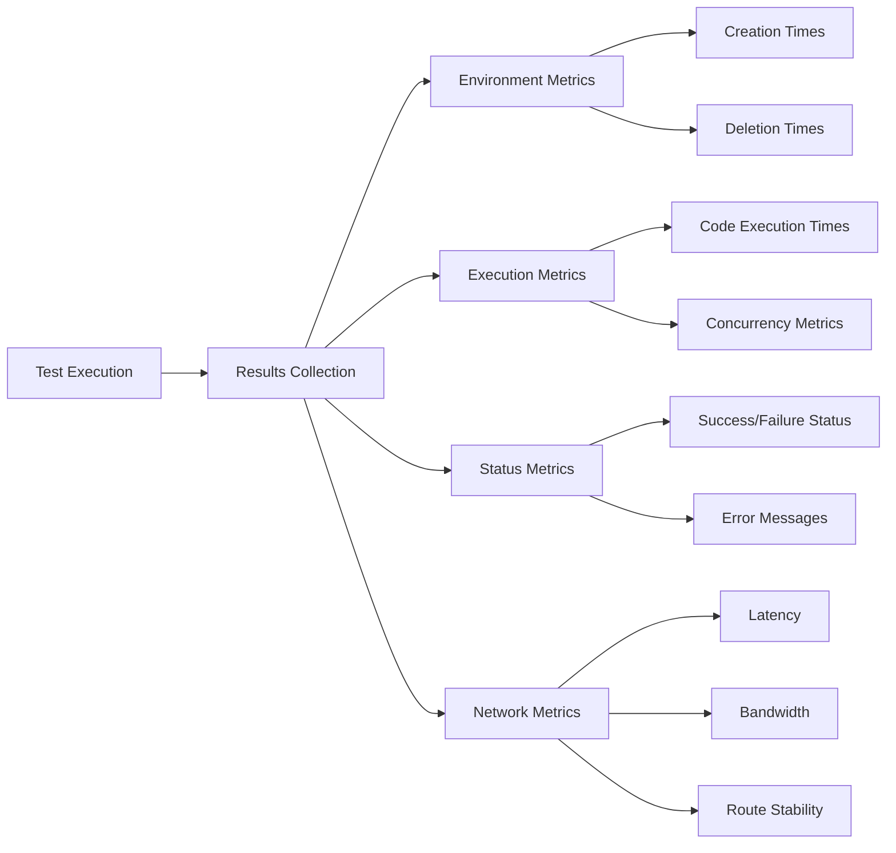

# AI Sandbox Environment Testing Framework

## Core Metrics

### 1. Speed/Performance
- Time to create new environment
- Time to execute code
- Time to tear down environment
- Network latency metrics

### 2. Reliability
- Success rate of environment creation
- Success rate of code execution
- Reproducibility of results
- Network stability metrics

## Test Implementation

### Test Case Structure
- Standard code execution scenarios
- LLM generated code execution
- Expected outputs/behaviors
- Performance benchmarks/thresholds
- Validation criteria
- Network performance requirements

### Testing Categories

1. **Speed Tests**
   - Environment creation time
   - Code execution time
   - Environment cleanup time
   - End-to-end workflow time
   - API response times

2. **Reliability Tests**
   - Create/destroy environments
   - Execute standard code samples
   - Verify environment isolation
   - Check cleanup completeness
   - Network connection stability

3. **Load Tests**
   - Concurrent environment creation
   - Parallel code executions
   - Peak load handling
   - Recovery from high load
   - Network bandwidth under load

4. **Concurrent Execution Tests**
   - Multiple simultaneous sandbox instances
   - Parallel diverse workloads
   - Verify sandbox isolation
   - Network performance under concurrency

5. **Network Performance Tests**
   - Client-API latency measurements
   - Workspace external connectivity
   - Standard endpoint response times (docker, pypi, npm, etc)
   - Geographic latency variations
   - Network route stability

### Results Collection
- Environment creation/deletion times
- Code execution times
- Success/failure status
- Error messages
- Concurrency metrics
- Network metrics

Inspiration: https://arxiv.org/pdf/2310.06770