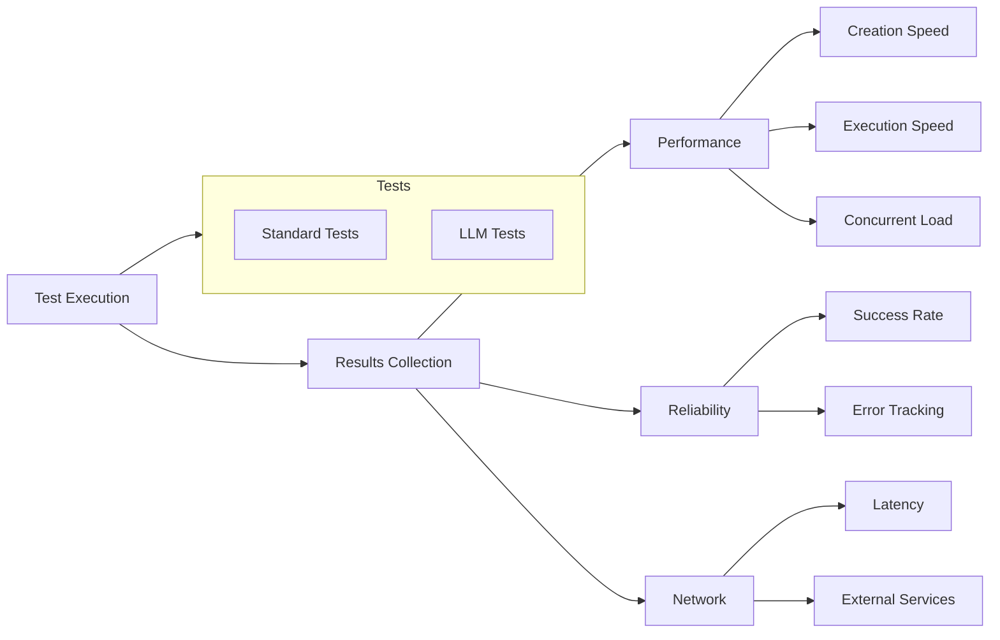

# AI Sandbox Environment Testing Framework

## Core Metrics

### 1. Speed/Performance
- Time to create new environment
- Time to execute code
- Time to tear down environment
- Time to run a load test on the environment
- Time to run defined number of concurent environments (10, 50, 100, 200)

### 2. Network
- Network latency metrics (between client and environment)
- API response times (Client-API latency measurements)
- Standard endpoint response times (docker, github, pypi, npm, etc)

### 3. Reliability
- Success rate of environment creation
- Success rate of code execution

## Test Implementation

### Test Case Structure
- Standard code execution scenarios
- LLM generated code execution
- Expected outputs/behaviors
- Performance benchmarks/thresholds
- Validation criteria
- Network performance requirements